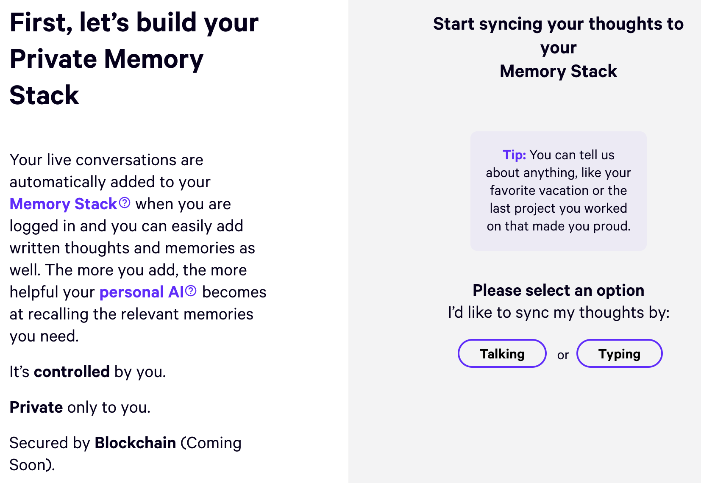
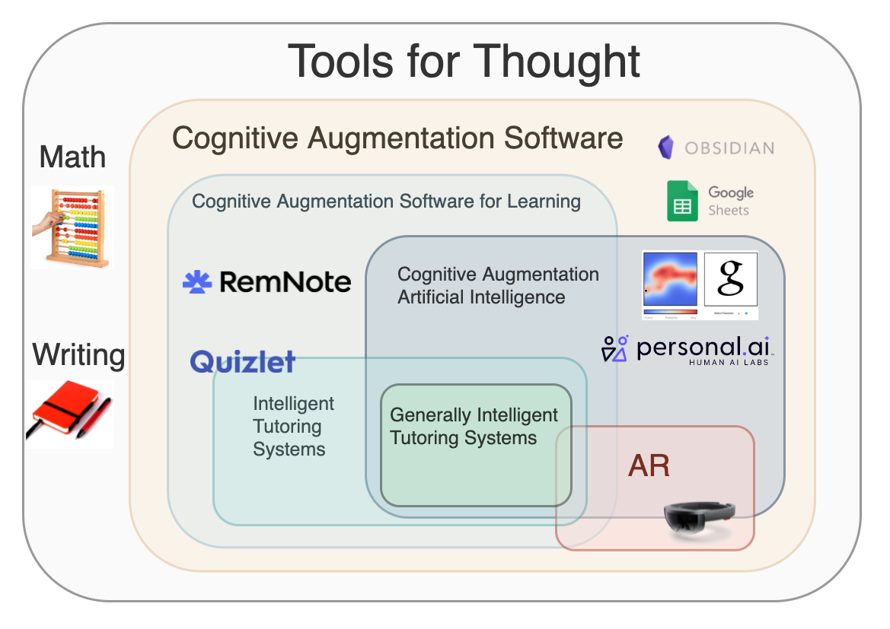

This article aims to create a more precise terminology and to give an overview of the progress and state of Cognition Augmentation Software (CAS). You can view the original RemNote article [here](https://www.remnote.io/a/cognition-augmentation-software-v1/601b10bbc39b680034b2d17a).

- [Thinking vs. Cognition](#thinking-vs-cognition)
  - [Tools For Thought](#tools-for-thought)
- [Augmented Cognition](#augmented-cognition)
  - [History](#history)
  - [Cognitive Technology](#cognitive-technology)
  - [Personal Knowledge Management](#personal-knowledge-management)
- [New types of augmenting devices and interfaces](#new-types-of-augmenting-devices-and-interfaces)
  - [Cognitive State measurement](#cognitive-state-measurement)
  - [Augmented Reality](#augmented-reality)
  - [Cognition Augmentation Software for Learning](#cognition-augmentation-software-for-learning)
- [Outlook, Market, and RemNote](#outlook-market-and-remnote)

# Thinking vs. Cognition

As neuroscientists like to say, we need tractable definitions. However, the term "Tools For Thought", which we use to describe tools like RemNote or Roam Research, is not clearly defined.

## Tools For Thought

In their work, [How can we develop transformative Tools For Thought? ](https://numinous.productions/ttft/) Michael Nielsen and Andy Matuschak describe the history of the term. The first usage of this term goes back to the early computer pioneers. In their essay, they state that they are using the word as a catch-all phrase. The main problem I see with it is that it does not differentiate between cognitive, e.g., cultural-evolutionary tools (like Hindu-Arabic numerals) and SaaS-like tools.

Thinking and Thoughts are also not clearly defined. For example, thought can be indulgence into an imaginative or pleasurable experience and, therefore, something that we don't try to improve through a tool's usage.

# Augmented Cognition

## History

This research goes back to the 1960s with the pioneering work of Douglas C. Engelbart. He viewed the process of [Augmenting Human Intellect](https://www.dougengelbart.org/content/view/138) as increasing the capability to solve complex problems by information handling and symbol structuring and to gain comprehension. The vision developed by Engelbart, J. C. R. Licklider, Alan Kay, and others had a strong influence on later entrepreneurs like Steve Jobs.

The field was finally formed in early 2000 under "Augmented Cognition" and instituted by the [Augmented Cognition Program](https://en.wikipedia.org/wiki/Augmented_cognition), which was renamed to _Improving Warfighter Information Intake Under Stress Program_ in 2001. The program was separated into four phases:

1. Measure cognitive state
2. Manipulate cognitive state
3. Exploit human sensory channels
4. Optimize information allocation

The main conference of the field is the [Augmented Cognition (AC) Conference](http://2021.hci.international/ac), an affiliated conference of the HCI International Conference, which will arrive at its 15th edition this July. Its last edition of 2018 brought forth two volumes of papers: [Augmented Cognition: Intelligent Technologies](https://link.springer.com/book/10.1007/978-3-319-91470-1) and [Augmented Cognition: Users and Contexts](https://link.springer.com/book/10.1007/978-3-319-91467-1).

The research field today relies heavily on the terminology of [Cognitive Load Theory](https://en.wikipedia.org/wiki/Cognitive_load). As we have seen, a big focus of the domain is to reduce Cognitive Overload. One way to do this is by developing schemas that act as memory templates coded into Long Term Memory by Working memory. If we help the users create new or surface relevant schemas, like an effective Mnemonic, we will be able to reduce their Cognitive Load, increase their productivity, and reduce the rate of error.

A second useful and related framework is the one of [Distributed Cognition](https://www.lri.fr/~mbl/Stanford/CS477/papers/DistributedCognition-TOCHI.pdf). It stated that cognitive processes are defined by the functional relationship among elements that participate in them and not by the spatial colocation of its elements. We will look at cloud-architectures that describe the combination of cognitive modules for augmentation interfaces later.

## Cognitive Technology

In 2016, Michael Nielsen, in his essay [Thought as a Technology](http://cognitivemedium.com/tat/), described the term cognitive technology as an external artifact designed by humans, which can be internalized and used as a substrate for cognition. These are representations invented by other people, such as words, graphs, maps, algebra, mathematical diagrams, etc. He further differentiated between Models of Augmentation as Cognitive Transformation (e.g., spreadsheet) or Cognitive Outsourcing (e.g., calculator).

A year later, in a paper titled, [Using Artificial Intelligence to Augment Human Intelligence](https://distill.pub/2017/aia/), he and his colleague Shan Carter expanded the concept into differentiating between Cognitive technology using Computers and Cognitive technology using Artificial Intelligence. The former is expanding human thought itself, meaning the computer performed action becomes a new generalizable concept. An example they give is the concept of applying a stamp in Photoshop to another layer. This concept is then generalized as `computer, [new type of action] this [new type of representation for a newly imagined class of object]`.

Cognitive technology using Artificial Intelligence discovers and reveals deep principles in ways meaningful to the user and helps us invent new cognitive technologies. The example they give here is an Interactive Generative Adversarial Model (iGAN) that, for example, shows a fashion designer useful operation as new primitives that he can then internalize.

Although the descriptions of those two terms still come with less clearly defined terms of "deep principles," "in a meaningful way," and "human thought," they might be summarized as the distinction between CAS and CAAI, Cognitive Augmentation AI.

## Personal Knowledge Management

A related concept, [Personal knowledge management
](https://en.wikipedia.org/wiki/Personal_knowledge_management) (PKM), is one way to Augmented Cognition. By helping us manage and externalize our knowledge, these systems enable us to work with a more significant knowledge base. In a broad sense, the accumulation of knowledge and know-how by networks of Personbytes can be seen as the basis for scientific and economic development described by César Hidalgo in his [Why Information Grows](https://books.google.de/books/about/Why_Information_Grows.html?id=hgOyBQAAQBAJ). PKM systems are often called "Second Brains.", but most of them act more as a storage medium and replica of its user's actual body of knowledge. At [RemNote](https://www.remnote.io/), we try to not just help you create a copy of your knowledge but an extension and augmentation of your brain.

# New types of augmenting devices and interfaces

In his seminal work from 1945 [As We May Think](https://www.theatlantic.com/magazine/archive/1945/07/as-we-may-think/303881/), Vannevar Bush describes the abilities of the [Memex](https://en.wikipedia.org/wiki/Memex) (a very advanced association-based PKM).

It, for example, should be able to retrieve and reproduce items many years old. He also describes its sharing-features as _"Wholly new forms of encyclopedias will appear, ready-made with a mesh of associative trails running through them, ready to be dropped into the Memex and there amplified. The lawyer has at his touch the associated opinions and decisions of his whole experience, and of the experience of friends and authorities. ..."_

But there has not been actual scientific work to engineer a cognition augmenting device as he describes it. However, this changed recently. In June 2019, two researchers published their work [Augmenting Cognition Through Edge Computing](https://eprints.lancs.ac.uk/id/eprint/132846/1/cogment2019.pdf), describing such a system's possible architecture: The RECALL Augmenting Memory architecture. It can, for example, help users restore context before their next conference or class. The student, walking to a lecture, could be primed with a summary of it through his smart glasses, surfacing relevant information. The description of the "Memory vault" in this architecture exhibits a high similarity to Vannevar Bush's Memex.

**But have people start building such a applications?**

[Recent leaks](https://www.youtube.com/watch?v=Kd34OMunStg) about the startup [Hu.ma.ne](Hu.ma.ne) hinted that they are building a contextual recall memory device in the form of a lapel pin. Though, their job listings on LinkedIn also listed a BCI engineer, so the thrill remains, especially since they stated that it would have the same kind of impact as the iPhone.

The more intriguing and already usable projuct in this realm under development might be [hu.man.ai](https://www.hu.man.ai/about). Suman Kanuganti and his colleagues are building a personal ai for memory storage. More precisely, they state that the product will safekeep the thoughts and memories that define you with your personal AI secured by a blockchain. A very compelling value proposition, I think. This is a great example of memory augmentation using Artificial Intelligence.

They also produced this very moving teaser video:

Another example of memory augmentation is RemNote. It's a tool for networked note-taking with a seamlessly integrated [integrated spaced repetition system (SRS)](https://en.wikipedia.org/wiki/Spaced_repetition). Currently, the offered spaced repetition algorithms are deterministic and do not utilize any artificial intelligence. Other SRS software products already showed the [successful application of Machine learning](https://www.youtube.com/watch?v=3QOs6D5nkRQ&t=12s).

## Cognitive State measurement

As we saw in the list of Goals of the Augmented Cognition Program, a great deal of research focuses on "Measure cognitive state." Many possible applications of adjusting information presentation to the user's cognitive abilities and background knowledge come to mind. For example, one could auto-control an audiobook's playback speed based on the listener's measured cognitive load.

## Augmented Reality

AR Interfaces leverage the cognitive processing speed of visuospatial data, e.g., the strong visuospatial perception that human evolution created. This is why they can be predicted to be the next paradigm of Human-computer interfaces. Those interfaces will give rise to many new ways of interacting with computation and new types of media. The advances in UX design show that interactions with digital interfaces become ever more natural and intuitive.

What do we mean by intuitive here? An example of such advancement is the development of the macintosh. Engineers and designers reduced the mouse interface's cognitive load by removing the second button and utilizing existing mental models. This design decision was brought forth by a memo titled 'One-Button Mouse' by the legendary Apple HCI scientist Larry Tesler (as explained in more detail in the book [Insanely great](https://books.google.com/books/about/Insanely_Great.html?id=Y6ZQAAAAMAAJ)).

Following the doctrine of _Build Glasses, not Binoculars_ ([Albrecht Schmidt 2019](https://videos.univ-grenoble-alpes.fr/video/5251-k03-making-humans-smarter-than-artificial-intelligence-digital-technologies-to-amplify-human-perception-and-cognition/)), we can envision AR Interfaces that allow us to browse a three-dimensional multimedia environment by navigating hand gestures rather than positioning a mouse on a desk.

## Cognition Augmentation Software for Learning

When augmenting cognitive processes, the most useful application is to look for the most cognitively taxing tasks, with learning being one of them. In [Life 3.0](https://en.wikipedia.org/wiki/Life_3.0), Max Tegmark describes a fictional AI, Prometheus, that helps humans learn:

> "Given any person's knowledge and abilities, Prometheus could determine the fastest way for them to learn any new subject in a manner that kept them highly engaged and motivated to continue and produce the corresponding optimized videos, reading materials, exercises, and other learning tools. [...] by leveraging Prometheus' movie-making talents, the video segments would truly engage, providing powerful metaphors that you would relate to, leaving you craving to learn more."

What Tegmark describes is called a very advanced [intelligent tutoring system](https://en.wikipedia.org/wiki/Intelligent_tutoring_system).

I'm optimistic that, given the technical feasibility and the fast advancements in the field of reinforcement learning, we will see the first more generally intelligent tutoring systems, similar to the fictional Prometheus, in the coming decades. Those will function in a more adaptable way taking into account the students' cognitive state and psychological profile.

# Outlook, Market, and RemNote

Summarizing, we can draw the following distinction between tools for thought and CAS and its tangents:

The future for CAS is bright and made inevitable through the acceleration of technology standards. One can describe three of those technology factors as:

- superior sensing and capturing systems
  - e.g., the possibility of continuous collection of memory cues through life-logging
- advances in audio and image processing enabling widespread mining of stored cues for proactive presentation
- pervasiveness of displays for displaying memory cues

In their essay, Michael Nielsen and Andy Matuschak describe the difficulty for developers of Tools For Thought to prevent copy-cats. They give the examples of Adobe, which invested heavily in developing their products and is now copied or disrupted by cloud-based companies like Figma. Considering the economic drivers discussed, one can be optimistic that future CAS (or Cognitive technology using Artificial Intelligence) that leverage proprietary AI and AR technology will have less of those difficulties.

As mentioned, many innovations we take for granted today originated out of AC research. However, to date, most of the research is intended for and was funded by military and defense agencies ([Drexler at al. 2007](https://link.springer.com/chapter/10.1007/978-3-540-73216-7_48)). This narrow focus might leave open a huge opportunity and an unaddressed consumer market of a growing number of knowledge workers. After all, the technologies developed as part of the research share the same goal of productivity improvements as the [\$102.98](https://www.prnewswire.com/news-releases/productivity-management-software-market-size-worth-102-98-billion-by-2027-grand-view-research-inc-301120852.html) Billion productivity software market.

We can describe [RemNote](https://www.remnote.io/) as CAS. Its integrated Spaced Repetition System (SRS) acts as a memory augmentation exploiting the Ebbinghaus Forgetting Curve. Its referencing features could be described as a Cognitive technology that lets its user reference concepts and construct new ones out of building blocks of other concepts.
Future features like the "Connection-recommendation" would be a Cognitive technology using Artificial Intelligence. It will be driven by an Artificial Intelligence-graph-algorithm that identifies [Structural Holes](https://en.wikipedia.org/wiki/Structural_holes) in the graph of a user's notes.

If you are building or researching Cognition Augmentation Software (CAS), I would be happy to have a chat!

Lastly, if you are a talented engineer, designer, or operator interested in working on cutting-edge productivity and learning software; [We are hiring](https://www.remnote.io/careers) and would love to hear from you!
