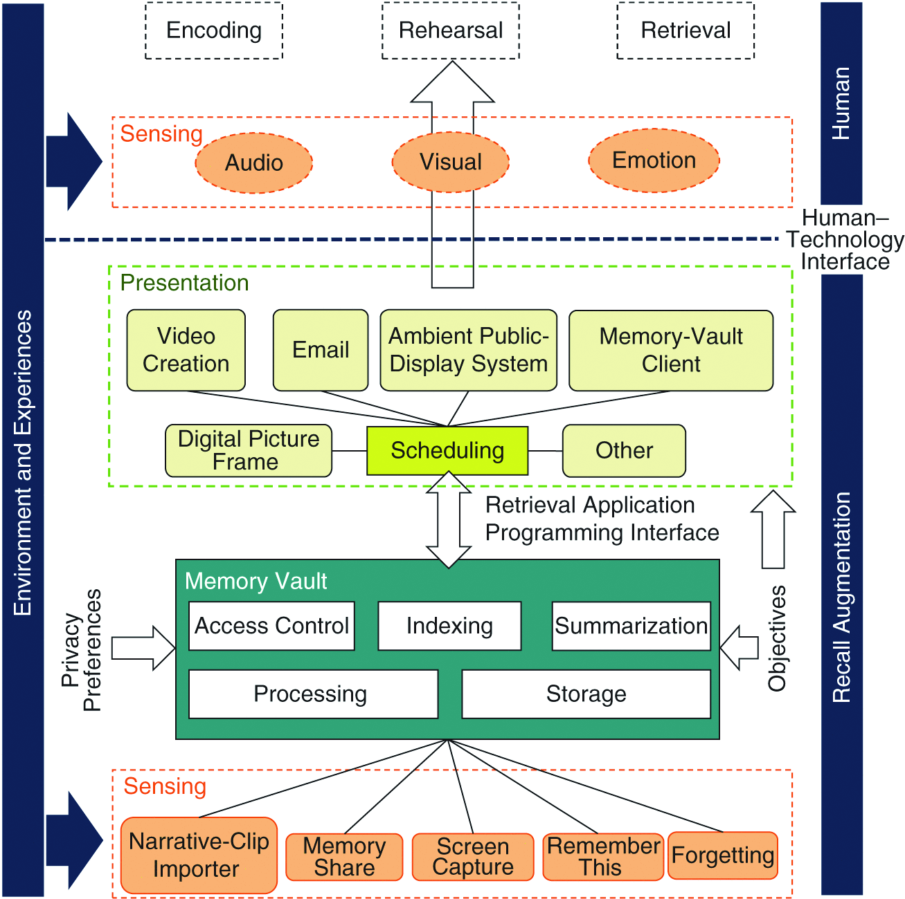
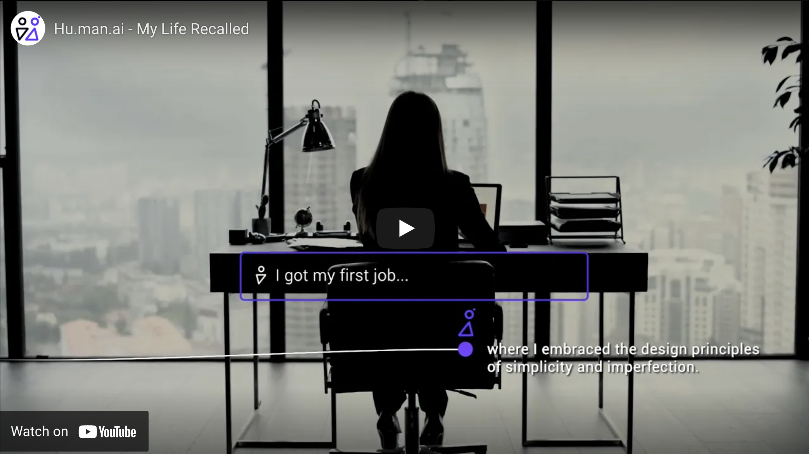

For millions of years, humans have used tools to augment their evolutionary abilities. A few thousand years ago, we invented writing and thereby enabled the sharing and externalizing of information, ushering in the bronze age. A few decades ago, we created the computer, inaugurating the information age. This new tool drastically expanded our abilities to share, internalize and work with knowledge.

Tools that augment our cognitive abilities with the help of computers are still in their infancy and will have a massive influence on the ages to come. This article aims to create a more precise terminology and to give an overview of the progress and state of Cognition Augmentation Software.

<!-- You can view the original RemNote article [here]
(https://www.remnote.io/a/cognition-augmentation-software-v1/601b10bbc39b680034b2d17a). -->

# Content

- [Content](#content)
- [Tools For Thought Terminology](#tools-for-thought-terminology)
- [Augmented Cognition](#augmented-cognition)
  - [History](#history)
  - [Distributed Cognition and Social Computing](#distributed-cognition-and-social-computing)
  - [Personal Knowledge Management](#personal-knowledge-management)
- [New types of augmenting devices and interfaces](#new-types-of-augmenting-devices-and-interfaces)
  - [Cognitive Technology](#cognitive-technology)
  - [Memory and Knowledge Augmentation](#memory-and-knowledge-augmentation)
  - [Cognitive State measurement](#cognitive-state-measurement)
  - [Augmented Reality](#augmented-reality)
- [Cognition Augmentation Software for Learning](#cognition-augmentation-software-for-learning)
  - [Intelligent Tutoring Systems](#intelligent-tutoring-systems)
- [Outlook, Market, and Trends](#outlook-market-and-trends)
  - [Trends](#trends)
  - [Development](#development)
  - [RemNote](#remnote)

 
 

# Tools For Thought Terminology

Standards, norms, terminology, and tractable definitions have guided many advancements in science and technology. However, the term _Tools For Thought_, which we use to describe tools like RemNote or Roam Research, is not clearly defined.

In their outstanding work, [How can we develop transformative Tools For Thought? ](https://numinous.productions/ttft/) Michael Nielsen and Andy Matuschak describe the history of the term. The first usage of it, they explain, goes back to the early computer pioneers. One problem I see with this term is that it does not differentiate between cognitive, e.g., cultural-evolutionary tools (like Hindu-Arabic numerals, i.e., numbers) and software tools, for example, note-taking apps.

Thinking and Thoughts are also not clearly defined, which makes the use of this term even harder. In this article, I will use the term Cognition Augmentation Software, or simply CAS, to describe software that augments our cognition.

# Augmented Cognition

## History

The research of this field goes back to the 1960s and the pioneering work of Douglas C. Engelbart. He viewed the process of [Augmenting Human Intellect](https://www.dougengelbart.org/content/view/138) as increasing the capability to solve complex problems by information handling and symbol structuring and to gain comprehension. The vision developed by Engelbart, J. C. R. Licklider, Alan Kay, and others had a strong influence on later entrepreneurs like Steve Jobs. It acted as the conceptual foundation for the personal computer.

The field was finally formed in early 2000 under the name of _Augmented Cognition_ and instituted by the [Augmented Cognition Program](https://en.wikipedia.org/wiki/Augmented_cognition), which was renamed to _Improving Warfighter Information Intake Under Stress Program_ in 2001. The program was separated into four phases:

1. Measure cognitive state
2. Manipulate cognitive state
3. Exploit human sensory channels
4. Optimize information allocation

The main conference of the field is the [Augmented Cognition (AC) Conference](http://2021.hci.international/ac), an affiliated conference of the HCI International Conference, which will arrive at its 15th edition this July. Its last edition of 2018 brought forth two volumes of papers: [Augmented Cognition: Intelligent Technologies](https://link.springer.com/book/10.1007/978-3-319-91470-1) and [Augmented Cognition: Users and Contexts](https://link.springer.com/book/10.1007/978-3-319-91467-1).

The research field today relies heavily on the terminology of [Cognitive Load Theory](https://en.wikipedia.org/wiki/Cognitive_load). A big focus of the domain is to reduce Cognitive Overload. One way to do this is by developing schemas that act as memory templates. A schema is a cognitive framework or concept that helps organize and interpret information. Schemas can be useful because they allow us to take shortcuts in interpreting the vast amount of information that is available in our environment. For example, a child might learn to classify a bird by noting that it is a creature with a muzzle and two wings. A more tangible example might be learning the mathematical notations of a new field. In the beginning, the symbols are foreign to us, but after a while, we build up a mental model of their function.

Schemas are coded into Long Term Memory by Working memory. If Working memory is overloaded, its schema building ability is compromised.

If we help someone to create new or surface relevant schemas, for example, by showing him a possible visualization of a mathematical operation, we support their schema-building abilities and reduce their Cognitive Load.

## Distributed Cognition and Social Computing

A second useful and related framework is [Distributed Cognition](https://www.lri.fr/~mbl/Stanford/CS477/papers/DistributedCognition-TOCHI.pdf). It defines cognitive processes by the functional relationship among elements that participate in them and not by its elements' spatial colocation. I.e., a distributed cognitive process can be managed by multiple components that each serve a specific function but are located in different places communicating over a network.

It also provides us with a framework to think about Collaborative Cognition, a system in which multiple intelligent agents collaboratively work on a problem. An example of such a collaboration is a brainstorming to which multiple humans and machines contribute.

This new and emergent field was termed [Social Computing](https://ieeexplore.ieee.org/document/9241509) by James Evans in September 2020. He describes it as the combination of socially inspired computer science and computationally enhanced social science, in which machines act as complements rather than substitutes for human cognition.

Social Computing aims to engineer systems for new social interaction between humans and machines that allow us to communicate more effectively by taking into account human biases.

We will look at cloud-architectures that describe the combination of cognitive modules for augmentation interfaces later.

## Personal Knowledge Management

A related concept, [Personal knowledge management
](https://en.wikipedia.org/wiki/Personal_knowledge_management) (PKM), is one way to Augmented Cognition. By helping us manage and externalize our knowledge, these systems enable us to work with a bigger knowledge base. In a broad sense, the accumulation of knowledge and know-how by networks of _personbytes_, described by César Hidalgo in his [Why Information Grows](https://books.google.de/books/about/Why_Information_Grows.html?id=hgOyBQAAQBAJ), can be seen as the basis for scientific and economic development. PKM systems are often called _Second Brains_, but most of them act more as a storage medium and replica of its user's actual body of knowledge. At [RemNote](https://www.remnote.io/), we try to not just help you create a copy of your knowledge but an extension and augmentation of your brain.

# New types of augmenting devices and interfaces

## Cognitive Technology

In 2016, Michael Nielsen, in his essay [Thought as a Technology](http://cognitivemedium.com/tat/), described the term cognitive technology as an external artifact designed by humans, which can be internalized and used as a substrate for cognition. These are representations invented by other people, such as words, graphs, maps, algebra, mathematical diagrams, etc. He further differentiated between Models of Augmentation as Cognitive Transformation (e.g., a spreadsheet) or Cognitive Outsourcing (e.g., a calculator).

A year later, in a paper titled, [Using Artificial Intelligence to Augment Human Intelligence](https://distill.pub/2017/aia/), he and his colleague Shan Carter expanded the concept into differentiating between Cognitive technology using Computers and Cognitive technology using Artificial Intelligence. The former is expanding human thought itself, meaning the computer performed action becomes a new generalizable concept. An example they give is the concept of applying a stamp in Photoshop to another layer. This concept is then generalized as `computer, [new type of action] this [new type of representation for a newly imagined class of object]`.

Cognitive technology using Artificial Intelligence discovers and reveals deep principles in ways meaningful to the user and helps us invent new cognitive technologies. The example they give here is an Interactive Generative Adversarial Model (iGAN) that, for example, shows a typographer useful operation as new primitives that he can then internalize (for designs without using the iGAN).

How this process can look like is demonstrated well and amusingly in a [YouTube videos by Károly Zsolnai-Fehér](https://www.youtube.com/watch?v=B8RMUSmIGCI&t=2s), in which he also describes it as the _artistic control over images_.

Although the descriptions of the two terms, provided by Nielsen and Carter, still comes with less clearly defined terms of "deep principles," "in a meaningful way," and "human thought," they help up draw a further categorization. For our purpose here, using our terminology, they might be summarized as the distinction between CAS and CAAI, Cognitive Augmentation AI.

It's still early for software tools like those iGANs explored above, but we can already see that _Offering predefined elements (shapes, text, symbols) directly exemplifies how a digital tool can augment human intelligence by allowing the user to get into the creative flow faster and minimize unnecessary construction work._, as Molly Mielke phrased it in her thesis [Computers and Creativity](https://www.mollymielke.com/cc).

## Memory and Knowledge Augmentation

In his seminal work from 1945 [As We May Think](https://www.theatlantic.com/magazine/archive/1945/07/as-we-may-think/303881/), Vannevar Bush describes the abilities of the [Memex](https://en.wikipedia.org/wiki/Memex) (a very advanced association-based PKM).

It, for example, should be able to retrieve and reproduce items many years old. He also describes its sharing-features as _"Wholly new forms of encyclopedias will appear, ready-made with a mesh of associative trails running through them, ready to be dropped into the Memex and there amplified. The lawyer has at his touch the associated opinions and decisions of his whole experience, and of the experience of friends and authorities. ..."_

But it all those years there not been actual scientific work to engineer a cognition augmenting device as he describes it. However, this changed recently. In June 2019, the two researchers, Mahadev Satyanarayanan and Nigel Davies, published a paper [Augmenting Cognition Through Edge Computing](https://eprints.lancs.ac.uk/id/eprint/132846/1/cogment2019.pdf), describing such a system's possible architecture: The RECALL Augmenting Memory architecture.

It might, for example, help users restore context before their next conference or class. The student, while walking to a lecture, could be primed with a lecture overview through his smart glasses, surfacing relevant information. The description of the "Memory vault" in this architecture exhibits a high similarity to Vannevar Bush's Memex.

**But have people start building such applications?**

[Recent leaks](https://www.youtube.com/watch?v=Kd34OMunStg) about the startup [Hu.ma.ne](Hu.ma.ne) hinted that they are building a contextual recall memory device in the form of a lapel pin. However, their job listings on LinkedIn also listed a BCI engineer, so the thrill remains, especially since they stated that it would have the same kind of impact as the iPhone.

The more intriguing and already usable product in this realm under development might be [personal.ai](https://www.personal.ai/) (formerly hu.man.ai). Its founder Suman Kanuganti and his colleagues are building a personal ai for memory storage. More precisely, they state that the product will _safekeep the thoughts and memories that define you with your personal AI secured by a blockchain_. A very compelling value proposition, I think. This product is an excellent example of memory augmentation using Artificial Intelligence.

Human AI's Head of Design, Kristie Kaiser, also [describes the application of Ambient Computing concepts as part of their product](https://medium.com/humanailabs/the-future-of-remembering-article-iii-effortless-recall-ux-for-everyone-2b16b5443a29). Ambient Computing is a user experience that is seamlessly integrated into the flow of the users' life and that requires no conscious action.

Lastly, they also produced this very moving teaser video:

Another example of memory augmentation is RemNote. It's a tool for networked note-taking with a seamlessly integrated [spaced repetition system (SRS)](https://en.wikipedia.org/wiki/Spaced_repetition). Currently, the offered spaced repetition algorithms are deterministic and don't incorporate any AI. Other SRS software products already showed the [successful application of Machine learning](https://www.youtube.com/watch?v=3QOs6D5nkRQ&t=12s).

## Cognitive State measurement

As we saw in the list of Goals of the Augmented Cognition Program, a great deal of research focuses on "Measure cognitive state." Many possible applications of adjusting information presentation to the user's cognitive abilities and background knowledge come to mind. For example, one could auto-control an audiobook's playback speed based on the listener's measured cognitive load (request for startup).

## Augmented Reality

AR Interfaces leverage the cognitive processing speed of visuospatial data, e.g., the strong visuospatial perception that human evolution created. This is why they can be predicted to be the next paradigm of Human-computer interfaces. Those interfaces will give rise to many new ways of interacting with computation and new types of media. The advances in UX design show that interactions with digital interfaces become ever more natural and intuitive.

What do we mean by intuitive here? An example of such an advancement in the development of the macintosh. Engineers and designers reduced the mouse interface's cognitive load by removing the second button and utilizing existing mental models. This design decision was brought forth by a memo titled 'One-Button Mouse' by the legendary Apple HCI scientist Larry Tesler (as explained in more detail in the book [Insanely great](https://books.google.com/books/about/Insanely_Great.html?id=Y6ZQAAAAMAAJ)).

Following the doctrine of _Build Glasses, not Binoculars_ ([Albrecht Schmidt 2019](https://videos.univ-grenoble-alpes.fr/video/5251-k03-making-humans-smarter-than-artificial-intelligence-digital-technologies-to-amplify-human-perception-and-cognition/)), we can envision AR Interfaces that allow us to browse a three-dimensional multimedia environment by navigating hand gestures rather than positioning a mouse on a desk.

# Cognition Augmentation Software for Learning

When augmenting cognitive processes, the most useful application is to look for the most cognitively taxing tasks, with learning being one of them.

In [Life 3.0](https://en.wikipedia.org/wiki/Life_3.0), Max Tegmark describes a fictional AI, Prometheus, that helps humans learn:

> "Given any person's knowledge and abilities, Prometheus could determine the fastest way for them to learn any new subject in a manner that kept them highly engaged and motivated to continue and produce the corresponding optimized videos, reading materials, exercises, and other learning tools. [...] by leveraging Prometheus' movie-making talents, the video segments would truly engage, providing powerful metaphors that you would relate to, leaving you craving to learn more."

## Intelligent Tutoring Systems

What Tegmark describes is called an [intelligent tutoring system (ITS)](https://en.wikipedia.org/wiki/Intelligent_tutoring_system), a computer system that aims to provide immediate and customized instruction or feedback to learners, usually without requiring intervention from a human teacher. The first widely used product of this kind was PLATO (Programmed Logic for Automatic Teaching Operations). It was started in 1960 at the University of Illinois at Urbana–Champaign and funded by the ARPA, the same institutions that also funded ARPANET, the precursor of today's Internet. The system proved beneficial for many students, especially those with learning disabilities, as they surmounted the classroom's social peer pressure, Brian Dear explains in a [talk held at Google](https://www.youtube.com/watch?v=mJhBLvqKUKU). Its commercialization NovaNET shut down after its acquisition in the early 2000s.

Kahn Academy, a product many readers will know, implements a more straightforward and older model called CAI (computer-assisted instruction).

The most successful product might be ALEKS (bought by McGraw-Hill). It implements [Knowledge Space Theory](https://en.wikipedia.org/wiki/Jean-Claude_Falmagne#Knowledge_spaces,_media_theory,_learning_spaces_and_the_ALEKS_software), a stochastic framework for the assessment of knowledge. It was developed by ALEKS' founder Dr. Jean-Claude Falmagne, a mathematical psychologist whose scientific contributions deal with problems in reaction time theory, psychophysics, philosophy of science, measurement theory, decision theory, and educational technology dev. Students using ALEKS navigates a graph of possible knowledge states, i.e., a learning space.

But what Tegmark describes is not a normal ITS, it is a very advanced ITS that can customize, generate tutoring content for its user and generalize to new fields. Unlike ALEKS, which is limited to predefined domains and content.

We can be optimistic that, given this technical feasibility and the fast advancements in fields such as reinforcement learning (a subfield of Machine Learning that focuses on learning agents), we will see the first more generally intelligent, Prometheus-like tutoring systems in the coming decades.

Those will function in a more adaptable way taking into account the students' cognitive state, personal preferences, and psychological profile.

# Outlook, Market, and Trends

Summarizing, we can draw the following distinction between tools for thought and CAS and its tangents:

## Trends

For many decades we have been removing points of friction that bottleneck our cognitive capabilities. A Google search that does not fall below our 250 millisecond limit of perceivable time differences will always feel too slow while waiting to absorb the information we searched for.

The introduction of the typewriter and computer removed the major bottleneck of handwriting for externalizing our thoughts. In his book [Smarter Than You Think](https://www.amazon.com/Smarter-Than-You-Think-Technology/dp/1594204454), Clive Thompson cites the research of the Stanford University literary scholar Andrea Lunsford, that examined freshman entry essays from 1917 until the present. Lunsford found that while grammatical error rates have stayed the same, the length and complexity of the essays have dramatically increased. "It's not that the kids of 1917 were stupider," says Thompson.1 "It's just that their tools were getting in the way of their thought."

One can only surmise what the next hundred years will do to internalize and externalize information using software tools. Three major technology standards influence the future of these tools and their accelerated development:

- superior sensing and capturing systems (e.g., the possibility of continuous collection of memory cues through life-logging)
- advances in audio and image processing enabling widespread mining of stored cues for proactive presentation
- pervasiveness of displays for displaying memory cues

## Development

In their essay, Michael Nielsen and Andy Matuschak describe the difficulty for developers of Tools For Thought to prevent copy-cats. They give the examples of Adobe, which invested heavily in developing their products and is now copied or disrupted by cloud-based companies like Figma. Considering the economic drivers discussed, one can be optimistic that future CAS (or Cognitive technology using Artificial Intelligence) that leverage proprietary AI and AR technology will have less of those difficulties.

As mentioned, many innovations we take for granted today originated out of AC research. However, to date, most of the research is intended for and was funded by military and defense agencies ([Drexler et al. 2007](https://link.springer.com/chapter/10.1007/978-3-540-73216-7_48)). This narrow focus might leave open a huge opportunity and an unaddressed consumer market of a growing number of knowledge workers. After all, the technologies developed as part of the research share the same goal of productivity improvements as the [\$102.98](https://www.prnewswire.com/news-releases/productivity-management-software-market-size-worth-102-98-billion-by-2027-grand-view-research-inc-301120852.html) Billion productivity software market.

## RemNote

We can describe [RemNote](https://www.remnote.io/) as CAS. Its integrated Spaced Repetition System (SRS) acts as a memory augmentation exploiting the Ebbinghaus Forgetting Curve. Its referencing features could be described as a Cognitive technology that lets its user reference concepts and construct new ones out of building blocks of other concepts.

Future features like the "Connection-recommendation" would be a Cognitive technology using Artificial Intelligence. It will be driven by an Artificial Intelligence-graph-algorithm that identifies [Structural Holes](https://en.wikipedia.org/wiki/Structural_holes) in the graph of a user's notes.

If you are building or researching Cognition Augmentation Software (CAS), I would be happy to have a chat!

Lastly, if you are a talented engineer, designer, or operator interested in working on cutting-edge productivity and learning software; [We are hiring at RemNote](https://www.remnote.io/careers) and would love to hear from you!
